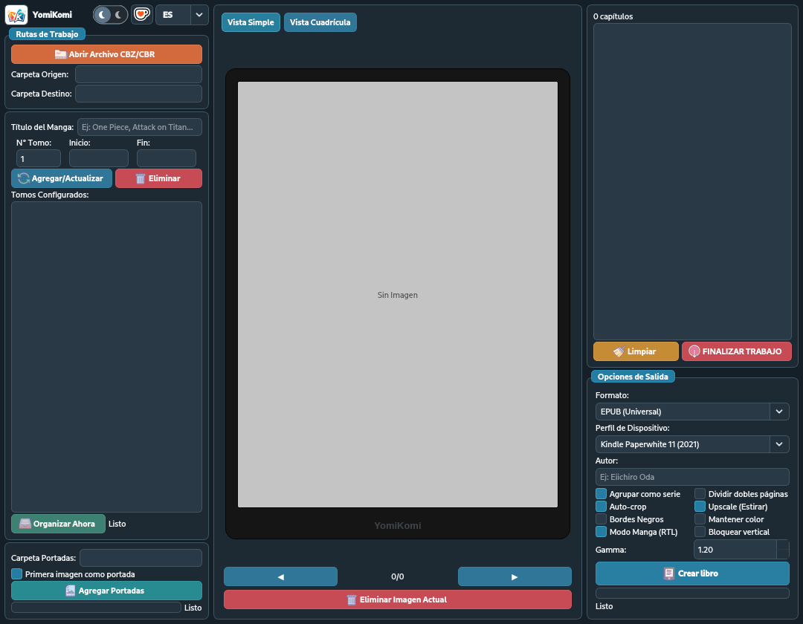

  

  
<strong>Convierte manga y cómics para leerlos cómodamente en Kindle, Kobo y otros dispositivos.</strong>

  

    
    
    
    
  

  

    <a href="https://vict-or853.github.io/yomikomi-tana/"><strong>Sitio web</strong></a>
    ·
    <a href="https://github.com/Vict-or853/yomikomi-tana/releases"><strong>Descargas</strong></a>
    ·
    <a href="https://github.com/Vict-or853/yomikomi-tana/issues"><strong>Soporte</strong></a>
  

> [!IMPORTANT]
> Este repositorio contiene únicamente documentación, capturas y archivos públicos de distribución. El código fuente de YomiKomi no se publica ni se licencia aquí.

## Acerca de YomiKomi

YomiKomi es una aplicación de escritorio para Windows diseñada para preparar manga, cómics e imágenes para lectores electrónicos. Organiza páginas, adapta resolución, recorta márgenes y exporta libros listos para leer.

Todo el procesamiento principal se realiza localmente en el equipo. Tus imágenes y libros no necesitan subirse a un servicio externo para convertirse.

  

## Funciones principales

- Importación de archivos CBZ, ZIP, CBR y RAR, además de carpetas de imágenes.
- Exportación a EPUB, CBZ y MOBI.
- Perfiles preparados para Kindle, Kobo y dispositivos genéricos.
- Orden de lectura manga de derecha a izquierda.
- Separación de páginas dobles y control de orientación.
- Recorte de márgenes, gamma, escala de grises y procesamiento en color.
- Vista previa antes de exportar.
- Interfaz clara u oscura disponible en varios idiomas.

## Flujo de trabajo

1. **Importa** un cómic, archivo comprimido o carpeta de imágenes.
2. **Organiza** las páginas y revisa el sentido de lectura.
3. **Optimiza** con el perfil de tu dispositivo y los ajustes visuales.
4. **Exporta** a EPUB, CBZ o MOBI y transfiere el resultado a tu lector.

## Descarga

Las versiones oficiales se publican en [GitHub Releases](https://github.com/Vict-or853/yomikomi-tana/releases).

1. Abre la versión más reciente.
2. Descarga el instalador o paquete para Windows indicado en sus notas.
3. Verifica el hash SHA-256 si la publicación lo incluye.
4. Ejecuta el instalador y sigue las instrucciones.

No descargues YomiKomi desde páginas de terceros que no estén enlazadas desde este repositorio o el sitio oficial.

## Requisitos

- Windows 10 u 11 de 64 bits.
- Espacio libre suficiente para los archivos originales y el libro generado.
- Para exportar a MOBI: Calibre con `ebook-convert` o KindleGen disponible en el sistema.

## Formatos

| Tipo | Formatos compatibles |
| --- | --- |
| Archivos de entrada | CBZ, ZIP, CBR y RAR |
| Imágenes | JPG, JPEG, PNG, WEBP, BMP, GIF, TIFF, JFIF y AVIF cuando el códec esté disponible |
| Libros de salida | EPUB, CBZ y MOBI |

## Perfiles de dispositivos

YomiKomi incluye perfiles para las familias Kindle Paperwhite, Kindle Oasis, Kindle Scribe, Kindle Basic, Kindle Colorsoft, Kobo Libra, Kobo Sage, Kobo Clara, Kobo Elipsa y una opción genérica de alta calidad.

Elige el perfil que coincida con tu dispositivo para aplicar dimensiones y ajustes adecuados. Si tu modelo no aparece, utiliza el perfil genérico y revisa la vista previa.

## Preguntas frecuentes

<strong>¿Necesito Calibre?</strong>

Solo para crear archivos MOBI mediante `ebook-convert`. La exportación a EPUB y CBZ no depende de Calibre.

<strong>¿Mis archivos se suben a internet?</strong>

No. La conversión principal se realiza localmente en tu computadora.

<strong>¿Dónde informo un problema?</strong>

Abre una incidencia mediante la plantilla de [reporte de errores](https://github.com/Vict-or853/yomikomi-tana/issues/new/choose). Incluye la versión, tu edición de Windows, pasos para reproducir el problema y una captura sin contenido sensible.

<strong>¿Puedo solicitar compatibilidad con otro dispositivo?</strong>

Sí. Crea una solicitud de función e incluye el nombre exacto del modelo, resolución de pantalla y formato preferido.

## Soporte y colaboración

Este repositorio acepta reportes de errores, solicitudes de funciones y mejoras a la documentación. Consulta [SUPPORT.md](SUPPORT.md) y [CONTRIBUTING.md](CONTRIBUTING.md) antes de crear una incidencia.

No adjuntes libros, mangas, cómics ni imágenes protegidas por derechos de autor. Para demostrar un problema, utiliza archivos propios, libres o una muestra mínima que tengas permiso para compartir.

## Privacidad y seguridad

- Consulta [PRIVACY.md](PRIVACY.md) para conocer cómo se tratan los archivos.
- Consulta [SECURITY.md](SECURITY.md) para informar una vulnerabilidad de forma responsable.
- El historial público de cambios se encuentra en [CHANGELOG.md](CHANGELOG.md).

  <strong>YomiKomi Tana</strong> 
  Creado por Víctor García · Vict_or853

